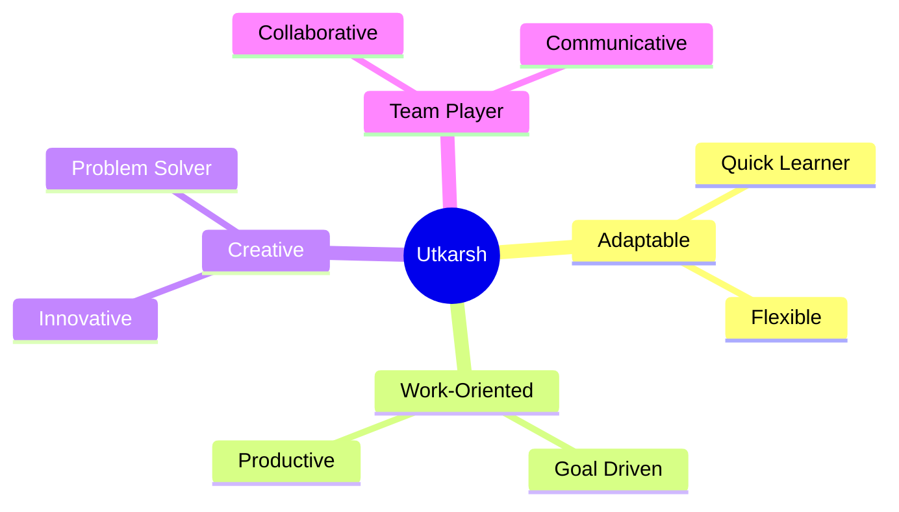

<div align="center">

# 👨‍💻 UTKARSH TRIVEDI


[](https://www.linkedin.com/in/utkarsh-trivedi-78b539246)
[](https://leetcode.com/Utkarsh_1129)
[](https://www.hackerrank.com/profile/Utkarsh_1129)

</div>

---

##  **ABOUT ME**

```javascript
const utkarsh = {
    role: "Aspiring Software Developer 🚀",
    education: "B.Tech in CSE @ MPEC, AKTU",
    passions: ["Coding", "AI/ML", "Problem Solving", "Innovation"],
    currentFocus: "Building scalable solutions with clean code",
    funFact: "I turn coffee into code ☕➡️💻"
};
```


## 🎯 **WHAT I DO**

<table>
<tr>
<td width="50%">

### 💡 Innovation
- Building **AI-powered applications**
- Solving **complex algorithms**
- Creating **user-friendly interfaces**

</td>
<td width="50%">

### 🛠️ Development
- **Full-stack** web development
- **Cloud-based** solutions
- **Data structures** optimization

</td>
</tr>
</table>

---

## 🎓 **EDUCATION**

 **Bachelor of Technology in Computer Science**  
📍 *Maharana Pratap Engineering College, AKTU*  
📅 *2022 – 2026*

---

## 💼 **EXPERIENCE**

<details open>
<summary><b>🌟 Google Cloud Generative AI - SmartInterz</b> (Sept - Oct 2024)</summary>
<br>

- ✅ Completed **Google Cloud Generative AI Tools** virtual internship
- 🧠 Hands-on with **Vertex AI, Prompt Engineering & NLP**
- 🎯 Mastered **Cloud-based AI workflows**

📜 [**View Certificate**](https://skillwallet.smartinternz.com/certificate/virtual-internship/250473494b245120a7eaf8b2e6b1f17c)

</details>

---

## 🚀 **FEATURED PROJECTS**

<table>
<tr>
<td width="50%">

### 🤖 **ATS Resume Analyzer**


**AI-powered resume analysis using Gemini 1.5**
- 📊 Real-time ATS optimization feedback
- 🎯 Smart recommendations
- ⚡ Built with Python & Google APIs

</td>
<td width="50%">

### 📸 **Photo Hunt**


**Dynamic image search engine**
- 🔍 Unsplash API integration
- 📱 Responsive design
- ⚡ Real-time pagination

</td>
</tr>
<tr>
<td width="50%">

### ✈️ **Airline Booking System**


**Console-based reservation system**
- 🎫 Ticket management
- 👥 Customer database
- 💾 File handling

</td>
<td width="50%">

### 🎯 **More Coming Soon...**


**Stay tuned for exciting projects!**

</td>
</tr>
</table>

---

## 💻 **TECH STACK**

<div align="center">

### Languages


### Web Technologies


### Tools & Platforms


</div>

---

## 📜 **CERTIFICATIONS**

| Certificate | Platform | Badge |
|-------------|----------|-------|
| **Fundamentals of Java Programming** | Board Infinity | [🔗 View](https://www.coursera.org/account/accomplishments/records/7DBXDCYEQ0W4) |
| **Python Essentials 1** | Cisco Networking Academy | [🔗 View](http://www.credly.com/badges/426283f8-b4b7-4657-ab6e-c20cde15b6c4) |
| **Web Development Fundamentals** | IBM SkillsBuild | [🔗 View](http://www.credly.com/badges/621a9d4d-a301-4144-a3b6-55fe2ba8fd39/public_url) |

---

## 🏆 **ACHIEVEMENTS**

<div align="center">

| Achievement | Year | Category |
|-------------|------|----------|
| 🏅 **Qualified for Smart India Hackathon** | 2023 & 2024 | Hackathon |
| 🏐 **3rd Place - Volleyball Tournament** | 2022 | Sports |
| 🎨 **2nd Place - Logo Design Competition** | - | Creative |

</div>

---

## 📊 **GITHUB STATS**

<div align="center">


</div>

---

## 🌈 **SOFT SKILLS**

<div align="center">



</div>

---

## 🎯 **CODING PROFILES**

<div align="center">

[](https://leetcode.com/Utkarsh_1129)

</div>

---

## 📫 **LET'S CONNECT!**

<div align="center">

<a href="https://www.linkedin.com/in/utkarsh-trivedi-78b539246">
  
</a>
<a href="https://leetcode.com/Utkarsh_1129">
  
</a>
<a href="https://www.hackerrank.com/profile/Utkarsh_1129">
  
</a>


</div>

---

<div align="center">

### 💭 *"Code is like humor. When you have to explain it, it's bad."* – Cory House


**⭐ Star my repositories if you find them interesting!**

</div>
